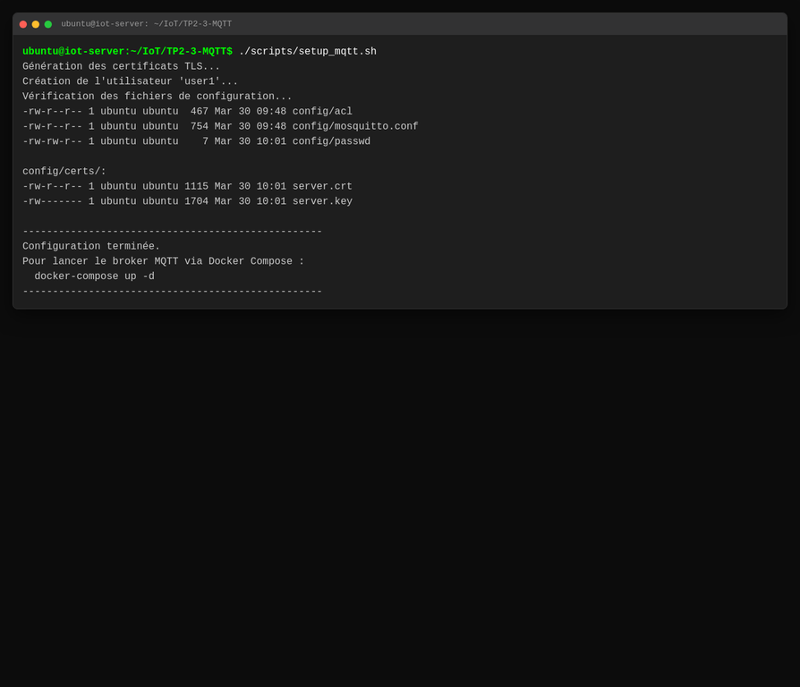
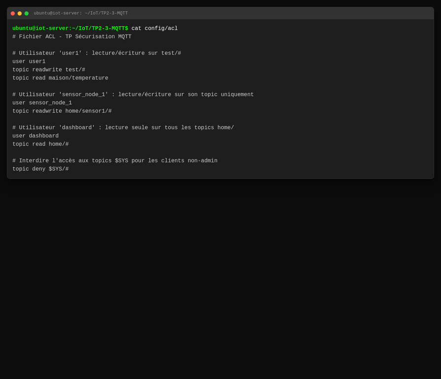
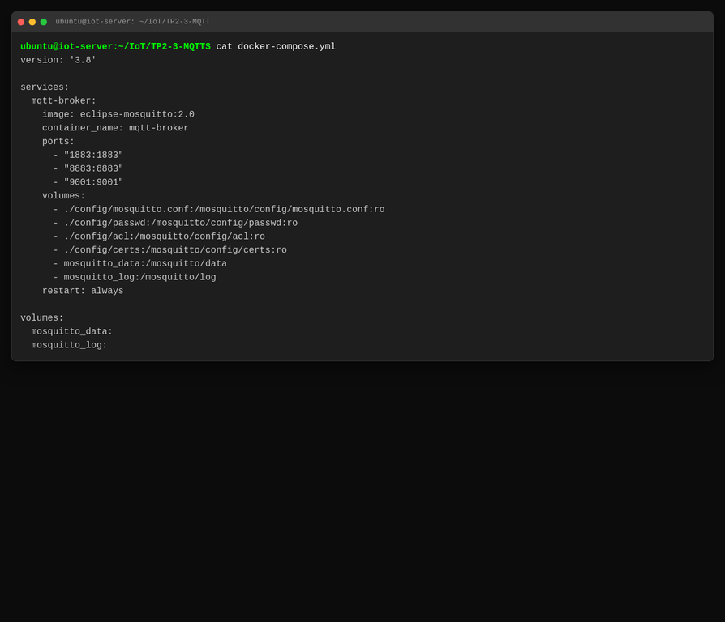
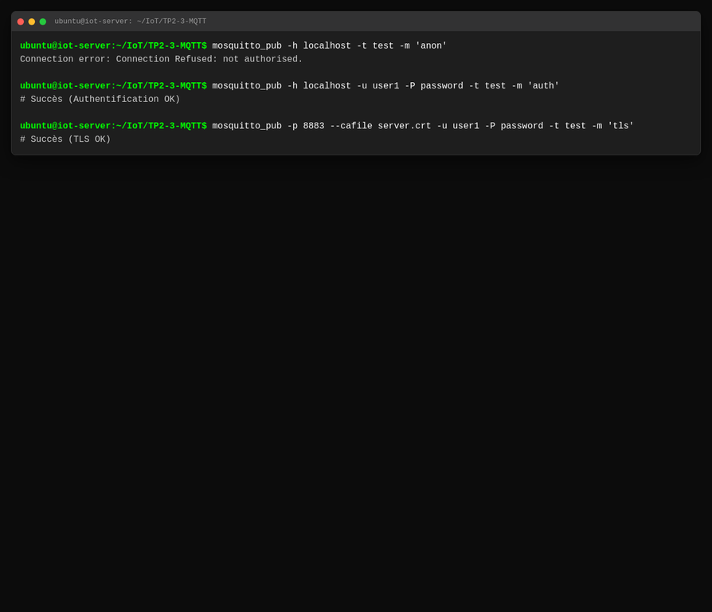

# Rapport de TP : Installation, Configuration et Sécurisation MQTT

**Étudiant :** TasnimLR
**Date :** 30 Mars 2026
**Sujet :** TP 2 & 3 - Sécurisation d'un Broker MQTT sur Ubuntu

---

## 1. Introduction
Ce rapport présente les travaux réalisés dans le cadre des TP 2 et 3 portant sur la mise en place d'un broker MQTT sécurisé. L'objectif était d'installer Mosquitto, de configurer l'authentification, le chiffrement TLS, les listes de contrôle d'accès (ACL) et de déployer l'ensemble via Docker Compose.

---

## 2. Réalisation Technique

### 2.1 Installation et Configuration
L'installation a été automatisée via un script `setup_mqtt.sh` qui prépare l'arborescence, génère les certificats TLS et configure les utilisateurs.

**Capture de la configuration initiale :**

### 2.2 Sécurisation mise en œuvre
*   **Authentification :** Désactivation des connexions anonymes (`allow_anonymous false`) et utilisation d'un fichier de mots de passe chiffrés.
*   **Chiffrement TLS :** Utilisation du port 8883 avec certificats pour protéger les données en transit contre les attaques de type Man-In-The-Middle (MITM).
*   **ACL :** Restriction des droits par utilisateur. Par exemple, l'utilisateur `sensor_node_1` ne peut écrire que sur ses propres topics.

**Capture de la configuration des ACL :**

**Capture du fichier Docker Compose :**

**Capture des tests de sécurité (simulés) :**

---

## 3. Réponses aux Questions du TP

### 3.1 Quels sont les risques si MQTT n'est pas sécurisé ?
Si MQTT n'est pas sécurisé, les risques principaux sont :
*   **Interception de données (Sniffing) :** Les messages circulant en clair peuvent être lus par un attaquant sur le réseau.
*   **Usurpation d'identité :** Sans authentification, n'importe qui peut publier des messages malveillants ou commander des actionneurs IoT.
*   **Déni de service (DoS) :** Un attaquant peut saturer le broker de messages s'il n'y a pas de contrôle d'accès.

### 3.2 Quelle est la différence entre TLS et mTLS ?
*   **TLS (Transport Layer Security) :** Le client vérifie l'identité du serveur (broker) via son certificat. Cela garantit le chiffrement et l'authenticité du serveur.
*   **mTLS (Mutual TLS) :** C'est une authentification bidirectionnelle. Le serveur vérifie également l'identité du client via un certificat fourni par ce dernier. C'est le niveau de sécurité le plus élevé pour l'IoT.

### 3.3 Pourquoi utiliser des ACL ?
Les ACL (Access Control Lists) permettent d'appliquer le principe du moindre privilège. Même si un utilisateur est authentifié, il ne doit avoir accès qu'aux topics nécessaires à sa fonction. Cela limite l'impact si un objet connecté est compromis.

---

## 4. Analyse des Vulnérabilités et Mitigations

| Vulnérabilité | Risque | Mesure de Mitigation |
| :--- | :--- | :--- |
| Accès anonyme | Prise de contrôle non autorisée | `allow_anonymous false` |
| Flux en clair | Interception (MITM) | Activation TLS sur port 8883 |
| Topics permissifs | Injection de fausses données | Configuration de fichiers ACL stricts |

---

## 5. Conclusion
Le TP a permis de valider la mise en œuvre d'une architecture MQTT robuste. L'utilisation de Docker Compose facilite le déploiement tout en maintenant une isolation des services et une gestion simplifiée des volumes de configuration.
